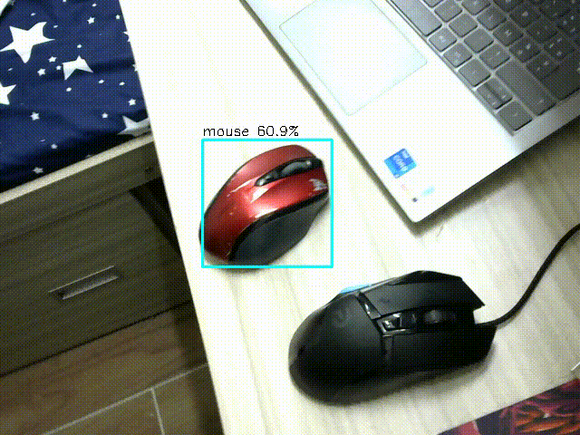
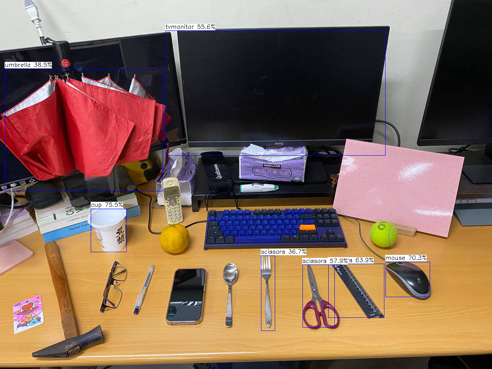
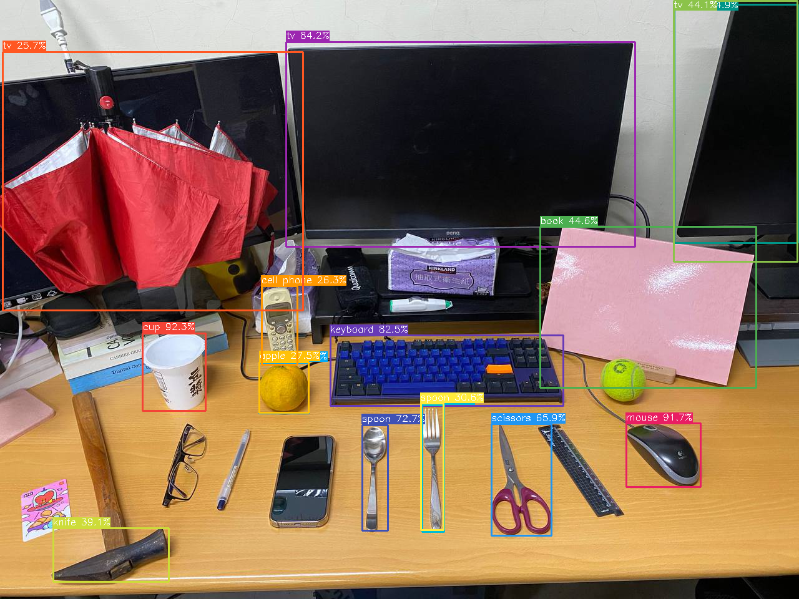
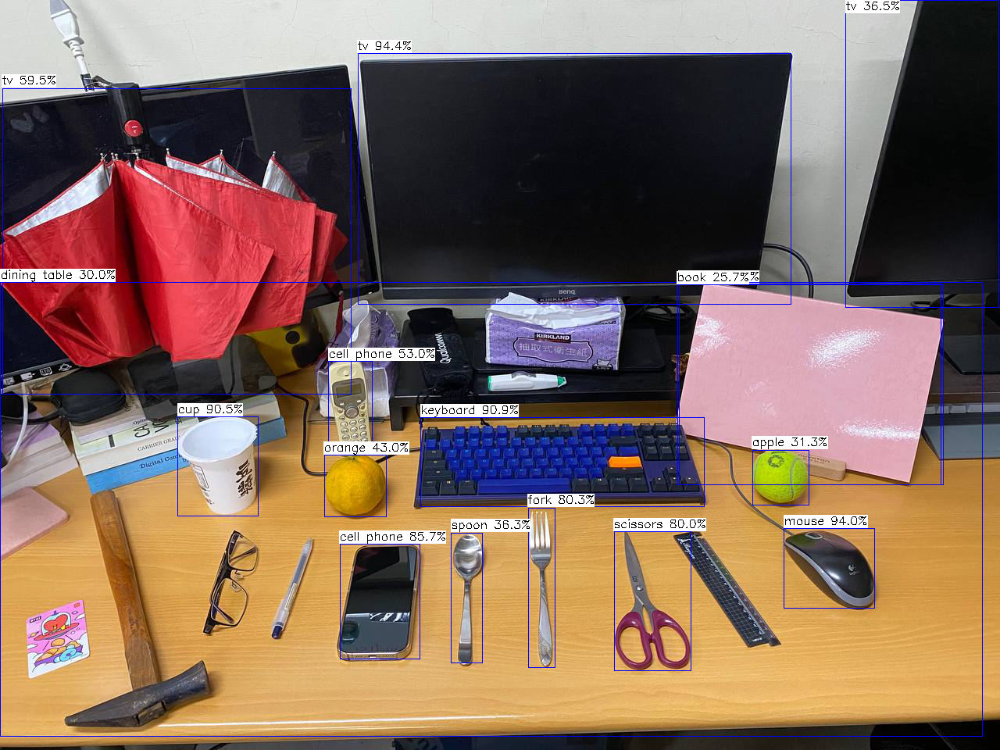
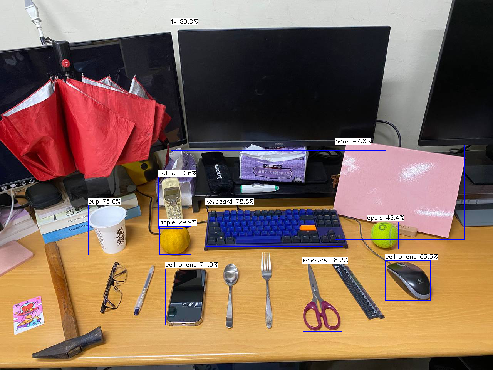

# embedded_cv
Embedded Computer Vision using Tencent NCNN running on EmbedSky E9v3 

|   Model   |   Inference Time |   Result |
|---    |:-:    |:-:    |
|   Yolo FastestV2   |   233 ms  |    |  
|   Yolov4 Tiny   |   2390ms   |    |  
|   Yolov7 Tiny   |   6659 ms  |    |  
|   YoloX   |   11655 ms  |    |
|   YoloXnano   |   1272 ms  |    |  

Using: 
 https://github.com/Tencent/ncnn  
 https://github.com/dog-qiuqiu/Yolo-FastestV2  
 https://github.com/Qengineering/YoloX-ncnn-Jetson-Nano  
